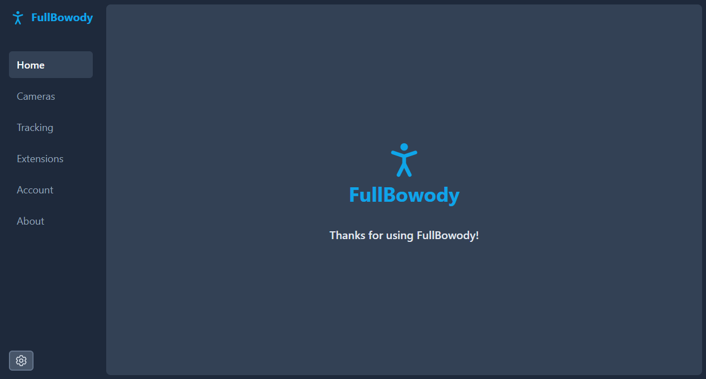

# FullBowody Application
This repository contains the source code for the FullBowody Application.
It is a web application used as an interface between the user and
the [FullBowody Engine](https://github.com/FullBowody/Engine).

More information about the FullBowody project can be found on the [FullBowody website](https://fullbowody.projects.furwaz.fr).



## Project Informations
- This project uses [Electron](https://www.electronjs.org/) to create a windowed application.
- The main used frameworks to create the UI are [Vue.js](https://vuejs.org/) and [TailwindCSS](https://tailwindcss.com/).
- The application uses [Vite](https://vitejs.dev/) as a build and development tool.
- All the server side code is written in [TypeScript](https://www.typescriptlang.org/).
- The application is packaged using [electron-builder](https://www.electron.build/).

## Clone the project
To clone the project, run
```bash
git clone --recurse-submodules https://github.com/FullBowody/application
```
Don't forget to clone the submodules, otherwise the engine part of the project will be missing.

## Setup the project
To install necessary dependencies for the application, run
```bash
npm install
```

## Build the wrapper
This application uses a [Node wrapper](https://github.com/FullBowody/node-wrapper) to communicate with the FullBowody engine.
To get a working communication between the application and the engine, you need to build the wrapper.
To build the wrapper, first go in the Node wrapper directory at `dependencies/wrapper` and run
```bash
npm install
```
Then, build the wrapper by running
```bash
npm run build
```
The node wrapper should now be built and ready to be used by the application.
If you ancouter any issues, please refer to the [Node wrapper](https://github.com/FullBowody/node-wrapper) repository.

## Run and debug the project
To run the project in a electron window 
with devtools enabled, run
```bash
npm run dev
```

## Build the application
To build the application, run
```bash
npm run build
```

## License
This project is licensed under the GNU GPL-3.0 License - see the [LICENSE](LICENSE) file for details

---
Authors :
[FurWaz](https://github.com/furwaz)
